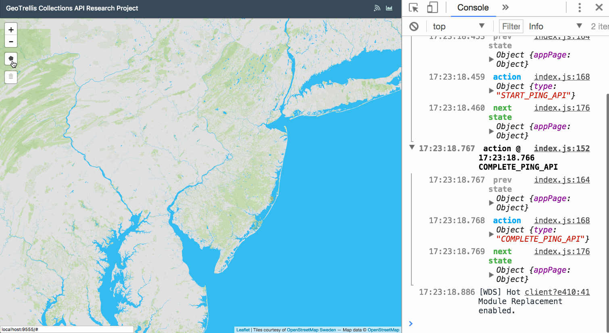

# geotrellis-collections-api-research

[](https://travis-ci.org/azavea/geotrellis-collections-api-research)

A research project to set up and use GeoTrellis as a REST service.



### Requirements

* Make
* Docker
* sbt
* Spark

### Getting started

#### Setup

After cloning the project, you'll need to [download the NLCD Pennsylvania 1992](http://www.pasda.psu.edu/uci/DataSummary.aspx?dataset=339), unzip it and save the `.tif` file in `./ingest/land-cover-data/geotiff`.

After copying the geotiff, make sure that Docker's running, then run

```sh
make
```

This will build the app client, compile the API service, ingest the geotiff data as an RDD, and start the app and API servers.

Note that this command requires that you have Spark installed locally with
`spark-submit` on your path.

#### Server

To start the app & API servers, run:

```
make server
```

This will start servers to run the app on port `9555` and the API on port `7000`.

### Ports

| Port | Service |
| --- | --- |
| [9555](http://localhost:9555) | Webpack dev server |
| [7000](http://localhost:7000) | GeoTrellis API |

### API Endpoints

Each of these API endpoints accepts a polygon geometry object posted from the client:

| Path | Service |
| --- | --- |
| `/panlcdcount` | Returns NLCD cell counts arranged by type for AOI |

### Make rules

| Rule | Description |
| --- | --- |
| `make build` | Install app container npm dependencies |
| `make compile` | Compile app & api for CI |
| `make app-console` | Log into app container shell |
| `make api-console` | Log into API with `./sbt console` |
| `make restart` | Start API with `./sbt ~reStart` |
| `make server` | Start app container & API service |
| `make ingest` | Ingest Pennsylvania NLCD GeoTiff into GeoTrellis RDD |
